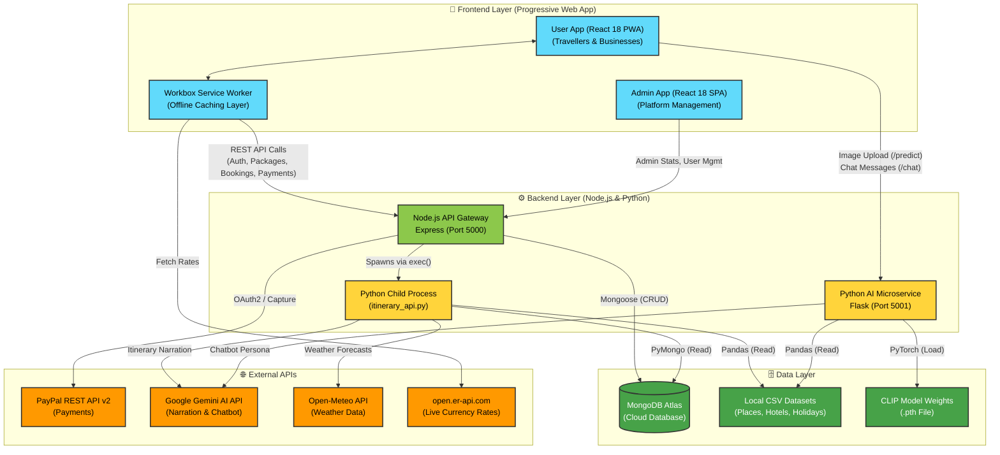

# CeylonRoam - High-Level System Architecture

This document contains the visual architecture diagram (rendered via Mermaid) and the step-by-step workflow of how the entire system connects.

## High-Level System Architecture Diagram

---

## 🔄 Entire System Workflow Explained

Here is the step-by-step breakdown of how data flows through the system for the main functional areas.

### 1. Standard Web Operations (CRUD, Auth, Bookings)
* **Frontend:** The React PWA sends HTTP requests (e.g., login, create booking, fetch packages). The Workbox Service Worker intercepts these. If offline, it serves cached `GET` requests.
* **Backend:** Requests reach the **Node.js API (Port 5000)**.
* **Database:** Node.js uses Mongoose to perform CRUD operations on **MongoDB Atlas**.
* **Response:** JSON data is returned to the React frontend.

### 2. Smart Trip Planning (The Hybrid Pipeline)
* **Frontend:** User submits trip constraints (budget, days, interests) in `TripPlanner.jsx`.
* **Backend:** The request hits Node.js (`/api/ai/generate-plan`). Node.js serializes the data and **spawns a Python child process** (`itinerary_api.py`).
* **Processing:** 
  * The Python script connects to **MongoDB Atlas** (via PyMongo) and local CSVs to fetch places/hotels.
  * It calls the **Open-Meteo API** to check for rain on specific travel dates.
  * It generates a deterministic mathematical route.
  * Finally, it passes the structured route to the **Google Gemini API** to write a human-readable travel blog.
* **Response:** The Python script prints the final JSON. Node.js captures this output and sends it back to the React frontend.

### 3. Image Recognition (Identify Tourist Spots)
* **Frontend:** User uploads a photo. The React app sends a `multipart/form-data` request *directly* to the **Flask Microservice (Port 5001)** via the `/predict` endpoint.
* **Processing:** 
  * Flask loads the fine-tuned PyTorch CLIP model weights (`.pth` file).
  * The image is processed and matched against 55 local Sri Lankan location classes from a local CSV.
* **Response:** Flask returns the predicted place name, district, and confidence score directly to React.

### 4. Real-Time Chatbot ("Roamy")
* **Frontend:** User types a message in the chat UI.
* **Backend:** The request is sent directly to the **Flask Microservice (Port 5001)** via the `/chat` endpoint.
* **Processing:** Flask wraps the user's message in a strict persona prompt and sends it to the **Google Gemini API**.
* **Response:** The AI's response is streamed/returned back to the React UI.

### 5. Payment Processing (PayPal)
* **Frontend:** User clicks "Pay with PayPal". React triggers a call to Node.js.
* **Backend:** Node.js (`/api/payments/create-order`) calls the **PayPal REST API** to generate an OAuth2 token and create an order.
* **Frontend:** The PayPal UI opens. User approves the payment.
* **Backend:** React tells Node.js to capture the payment (`/api/payments/capture-order`). Node.js calls PayPal to capture funds, then updates the booking status in **MongoDB Atlas** to "Confirmed".

### 6. Multi-Currency Offline Sync
* **Frontend:** On load, React fetches live exchange rates from the external **open.er-api.com**.
* **Storage:** The rates are saved in `localStorage`. 
* **Offline Fallback:** If the network goes down, the app automatically switches to the cached rates (or hardcoded static rates) to ensure prices always display correctly.
