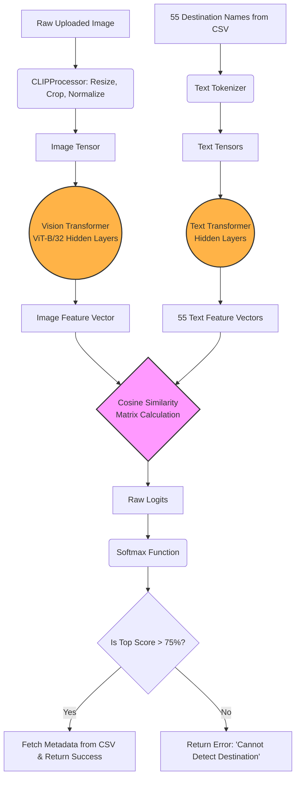
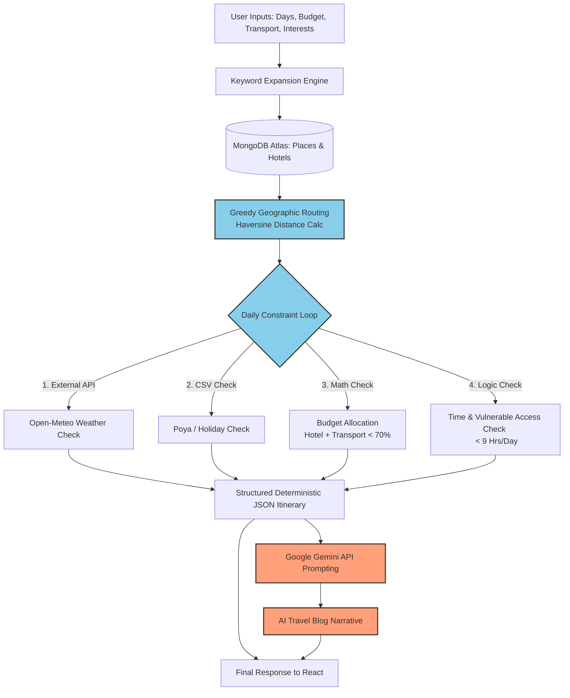

# Internal System Workflows (Hidden Layers)

This document explains the deep internal mechanics ("hidden layers") of the two most complex AI pipelines in the CeylonRoam platform. This is highly suitable for your **System Design** or **Implementation** chapters.

---

## 1. The CLIP Model Pipeline (Image Recognition)

The image recognition system does not simply "guess" the image. It uses a **Contrastive Language-Image Pretraining (CLIP)** architecture. Here is exactly what happens mathematically and logically under the hood in `server.py`:

### Internal Workflow

1. **Input Preprocessing:**
   * The user uploads an image. Python's `PIL` library converts it strictly to RGB format.
   * The `CLIPProcessor` steps in: it resizes, center-crops, normalizes pixel values, and converts the image into a PyTorch tensor (`pixel_values`).
2. **Zero-Shot Text Prompting:**
   * During server boot, the system reads 55 Sri Lankan destination classes from `image_dataset_info_enriched.csv`.
   * It wraps them in a prompt template: `"A photo of {class_name}"`.
   * The text processor tokenizes these 55 sentences into mathematical tensors (`input_ids` and `attention_mask`).
3. **The Hidden Layers (Dual Encoders):**
   * **Vision Transformer (ViT-B/32):** The image is sliced into 32x32 pixel patches. These patches pass through multiple self-attention layers to generate an *Image Feature Vector*.
   * **Text Transformer:** The 55 text prompts pass through the text encoder to generate 55 *Text Feature Vectors*.
4. **Contrastive Matching (Dot Product):**
   * Both the image vector and text vectors are projected into a shared mathematical space.
   * The model calculates the Cosine Similarity (dot product) between the single image vector and all 55 text vectors simultaneously.
5. **Softmax & Thresholding:**
   * The raw similarity scores (logits) are pushed through a `softmax` activation function, converting them into a probability percentage (e.g., 91.47%).
   * A strict **75% confidence threshold** is applied. If the top score is below 75%, the system throws an error (preventing hallucinations on random images). If above 75%, it fetches the district and description from the local CSV and returns the success JSON.

### Visual Architecture Diagram (Mermaid)

---

## 2. The Smart Itinerary Pipeline (Hybrid AI Engine)

The itinerary generator does not rely purely on an LLM (like ChatGPT) because LLMs hallucinate distances, prices, and travel times. Instead, `itinerary_api.py` uses a **Hybrid Pipeline**: a deterministic mathematical engine combined with Generative AI narration.

### Internal Workflow

1. **Keyword Expansion (NLP Rule-Based):**
   * The user inputs interests (e.g., "beach"). The `enhance_search_keywords()` function detects this and injects related hidden keywords (`["ocean", "coast", "surf", "galle", "mirissa"]`) to ensure maximum database matches.
2. **Database Ingestion:**
   * `PyMongo` connects to MongoDB Atlas, pulling all documents from the `places` and `hotels` collections and converting them into Pandas DataFrames for high-speed mathematical operations.
3. **Geographic Greedy Routing (The Traveling Salesperson Solution):**
   * The system checks the user's starting location (e.g., Colombo).
   * It filters available districts based on the expanded keywords.
   * If priority districts are found, it routes there. If not, it uses the **Haversine formula** to calculate the distance from the current latitude/longitude to the center point of all unvisited districts, always picking the nearest one to minimize travel time.
4. **The Daily Constraint Loop (Hidden Logic Engine):**
   * **Weather Check:** Hits the `Open-Meteo API` with the district's lat/lon and the specific travel date. If rain is detected, it flags a weather warning.
   * **Holiday Check:** Checks `srilanka_holidays.csv`. If it's a Poya Day, it warns the user that meat/liquor shops are closed.
   * **Budgeting Check:** Calculates transport cost `(distance + 30km) * cost_per_km`. Then finds the highest-rated hotel within a 20km radius where `(Hotel + Transport) <= 70% of Daily Budget`.
   * **Time & Accessibility Check:** Looks for tourist places <= 35km from the hotel. It uses `estimate_visit_time()` (e.g., Safari = 3.5 hrs, Waterfall = 1 hr). If `has_vulnerable` is true, it triggers `check_accessibility()` which automatically filters out hard hikes (e.g., Adam's Peak). Total activity time is strictly capped at 9 hours per day.
5. **LLM Narration Injection:**
   * Once the mathematical routing, costing, and constraint-checking are complete, the resulting rigid JSON structure is injected into a strict prompt.
   * This is sent to the **Google Gemini API** (`gemini-2.5-flash`), which is instructed to act as a local travel expert and convert the cold JSON data into a warm, blog-style story.
6. **Final Output:** The mathematically safe route and the AI story are combined and returned to Node.js.

### Visual Architecture Diagram (Mermaid)

